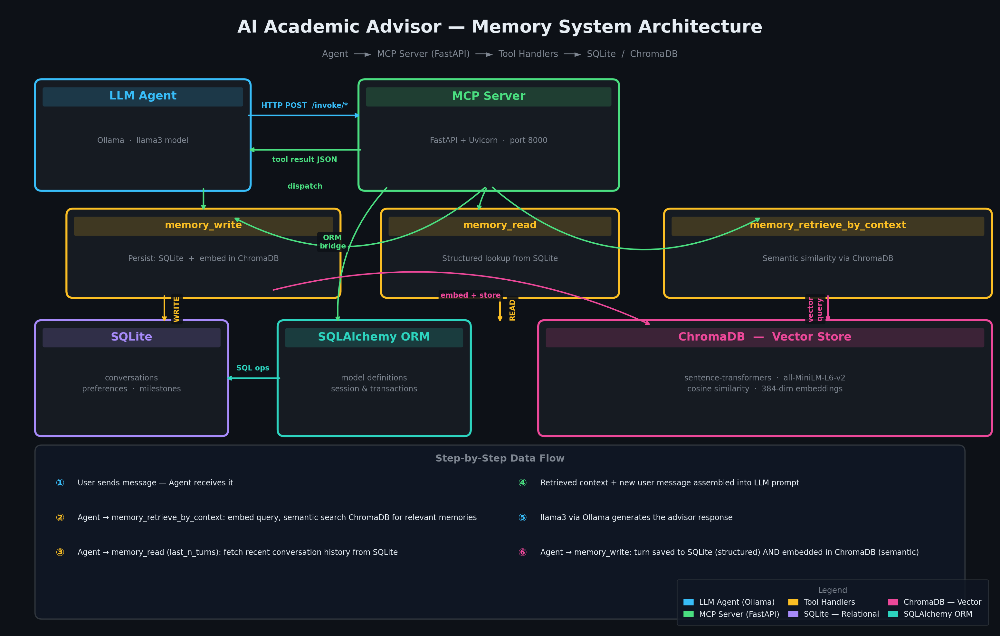

# Persistent-Memory AI Academic Advisor with MCP Server and Vector Search

A production-grade AI academic advisor that maintains long-term, context-aware memory
across conversations. The system separates the language model from its memory layer
using the Memory, Control, and Process (MCP) architectural pattern, enabling the
advisor to recall student preferences, past conversations, and academic milestones
beyond the constraints of any single context window.

---

## Architecture

The system is composed of three main layers:

| Layer | Technology | Responsibility |
|---|---|---|
| Agent | Python + Ollama (llama3) | Conversational interface, tool orchestration |
| MCP Server | FastAPI + Uvicorn | Memory tool API, request routing, validation |
| Relational Store | SQLite + SQLAlchemy | Structured memory: conversations, preferences, milestones |
| Vector Store | ChromaDB + sentence-transformers | Semantic memory: similarity-based context retrieval |

Data flow:

1. The user sends a message to the agent.
2. The agent calls `memory_retrieve_by_context` to fetch semantically relevant past memories.
3. The agent calls `memory_read` to fetch recent conversation turns.
4. Both are injected into the prompt as context.
5. The LLM generates a response.
6. The agent calls `memory_write` to persist the new turn to both SQLite and ChromaDB.



---

## Prerequisites

- Docker and Docker Compose installed
- Ollama installed and running on your host machine with the llama3 model pulled

To install Ollama and pull the model:

```bash
# Install Ollama (Linux)
curl -fsSL https://ollama.com/install.sh | sh

# Pull the llama3 model
ollama pull llama3
```

---

## Setup and Running

### 1. Clone the repository

```bash
git clone https://github.com/Rushikesh-5706/Persistent-Memory-AI-Academic-Advisor-with-an-MCP-Server-and-Vector-Search.git
cd Persistent-Memory-AI-Academic-Advisor-with-an-MCP-Server-and-Vector-Search
```

### 2. Configure environment variables (Local agent use only)

The MCP server is pre-configured via inline environment variables in `docker-compose.yml`
and will run out-of-the-box with zero setup.

If you plan to run the conversational agent locally, you can optionally configure `.env`:

```bash
cp .env.example .env
```

### 3. Start the MCP server

```bash
docker-compose up --build
```

Wait for the health check to pass. The server is ready when you see:
`mcp_server  | INFO:     Application startup complete.`

### 4. Run the agent (optional, for interactive use)

In a separate terminal:

```bash
cd agent
pip install -r requirements.txt
python agent.py
```

---

## API Reference

All endpoints are served from `http://localhost:8000`.

### Health Check

```
GET /health
```

Response:
```json
{"status": "ok"}
```

### List Tools

```
GET /tools
```

Returns the list of all available memory tools with their descriptions.

### Write Memory

```
POST /invoke/memory_write
```

Request body:
```json
{
  "memory_type": "conversation",
  "data": {
    "user_id": "student_001",
    "turn_id": 1,
    "role": "user",
    "content": "I want to major in bioinformatics."
  }
}
```

Supported `memory_type` values: `conversation`, `preference`, `milestone`

Response (201):
```json
{"status": "success", "memory_id": "conv_student_001_1"}
```

### Read Memory

```
POST /invoke/memory_read
```

Request body:
```json
{
  "user_id": "student_001",
  "query_type": "last_n_turns",
  "params": {"n": 5}
}
```

Supported `query_type` values: `last_n_turns`, `preferences`, `milestones`

### Retrieve by Context

```
POST /invoke/memory_retrieve_by_context
```

Request body:
```json
{
  "user_id": "student_001",
  "query_text": "What subjects does this student find interesting?",
  "top_k": 3
}
```

Returns semantically similar stored memories with relevance scores.

---

## Project Structure

```
.
├── docker-compose.yml          orchestrates the mcp_server service
├── Dockerfile                  builds the mcp_server image
├── .env.example                documents all required environment variables
├── submission.json             test data for automated evaluation
├── docs/
│   └── memory_architecture.png system architecture diagram
├── mcp_server/
│   ├── main.py                 FastAPI application, route handlers
│   ├── database.py             SQLAlchemy models, session management, CRUD operations
│   ├── memory_schemas.py       Pydantic v2 request/response schemas
│   ├── vector_store.py         ChromaDB client, embedding generation, similarity search
│   ├── tools.py                Tool registry and execution logic
│   └── requirements.txt        Python dependencies
└── agent/
    ├── agent.py                Ollama-powered conversational agent
    └── requirements.txt        Agent dependencies
```

---

## Memory Schema Reference

| Schema | Fields |
|---|---|
| Conversation | user_id, turn_id, role, content, timestamp |
| UserPreferences | user_id, preferences (JSON dict) |
| Milestone | user_id, milestone_id, description, status, date_achieved |

---

## Design Decisions

**Why SQLite for structured data?**
SQLite requires no separate server process, persists to a single file volume-mounted
from the host, and handles the transaction volumes expected for an academic advisor
workload without contention. SQLAlchemy provides the ORM layer with full migration
support if a more capable database becomes necessary.

**Why ChromaDB for vector search?**
ChromaDB operates in embedded mode with file-based persistence, matching the
deployment model of this project. It supports cosine similarity natively and
integrates cleanly with sentence-transformers without requiring a separate service.

**Why all-MiniLM-L6-v2 for embeddings?**
This model runs efficiently on CPU, produces 384-dimensional embeddings that balance
semantic quality with storage and compute cost, and is well-tested for English
sentence-level similarity tasks — exactly the retrieval pattern used here.

**Idempotent writes**
Both the conversations table and the milestones table enforce unique constraints on
(user_id, turn_id) and (user_id, milestone_id) respectively. The write functions
perform upsert operations, so duplicate writes are handled without errors or
duplicate records.

---

## Troubleshooting

**The MCP server fails to start**
Check that the `./data` directory is writable. The container writes the SQLite
database and ChromaDB files there. Run `mkdir -p data && chmod 777 data` if needed.

**Ollama connection refused in the agent**
Ensure Ollama is running on your host with `ollama serve` and that the
`OLLAMA_BASE_URL` in `.env` matches. On Linux, `http://localhost:11434` works
directly. On macOS or Windows with Docker Desktop, use `http://host.docker.internal:11434`.

**Semantic search returns empty results**
The collection filters by `user_id`. Ensure the `user_id` in the retrieve request
matches the one used during the write operations.
